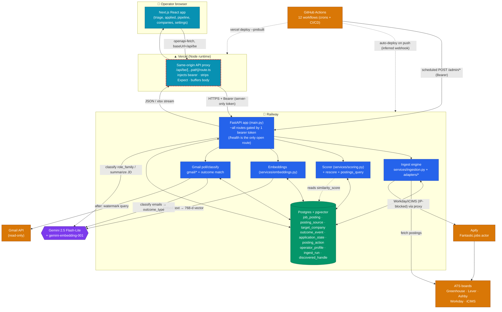
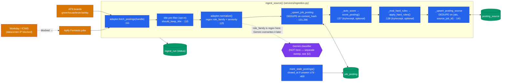
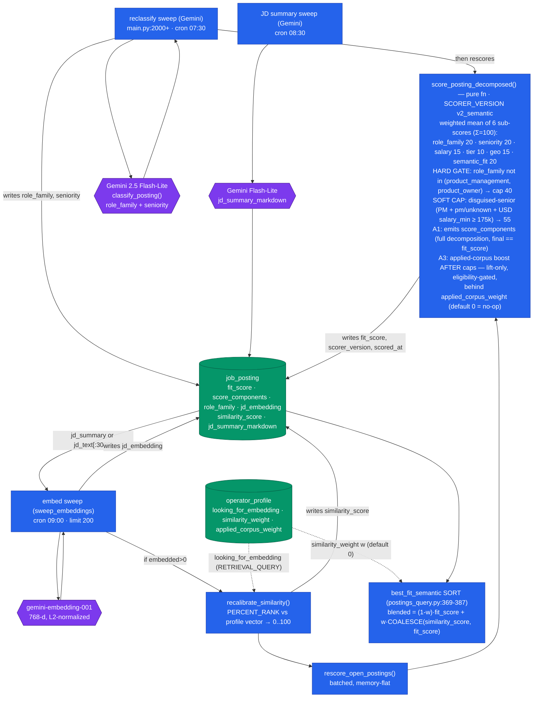
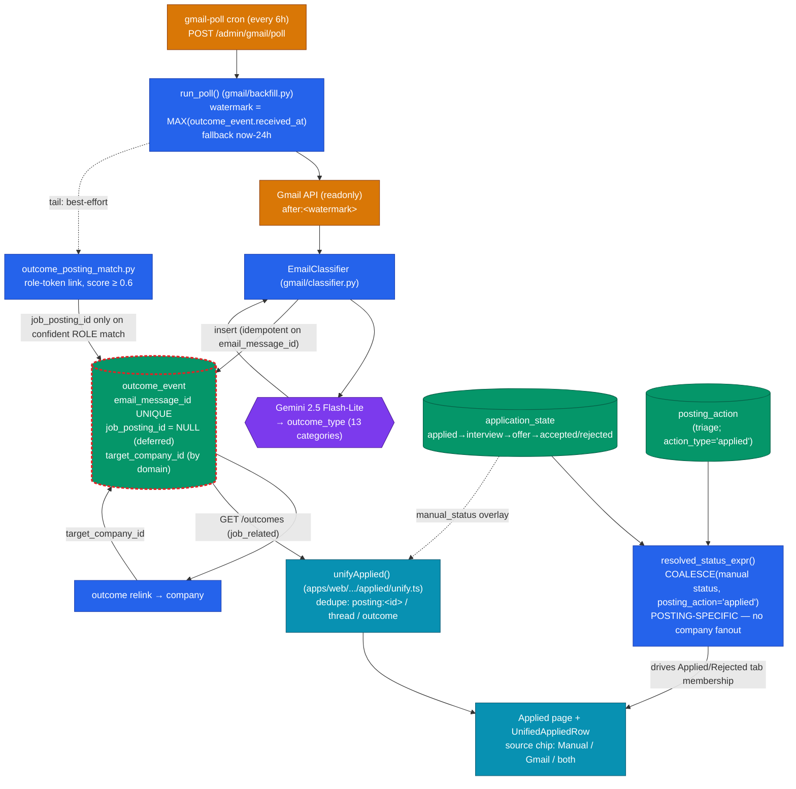
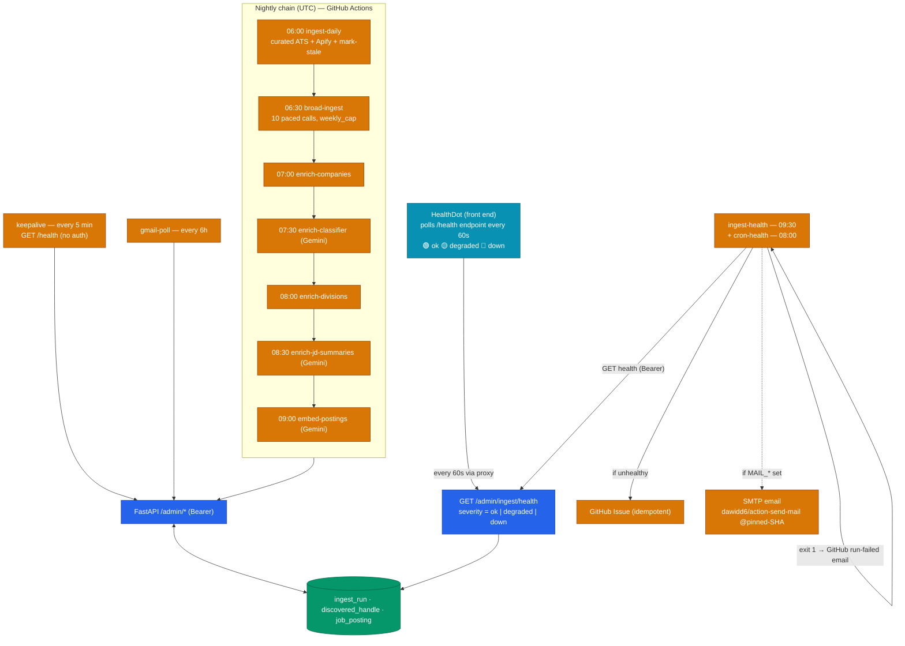
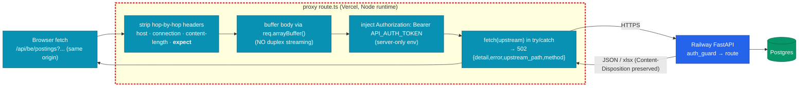
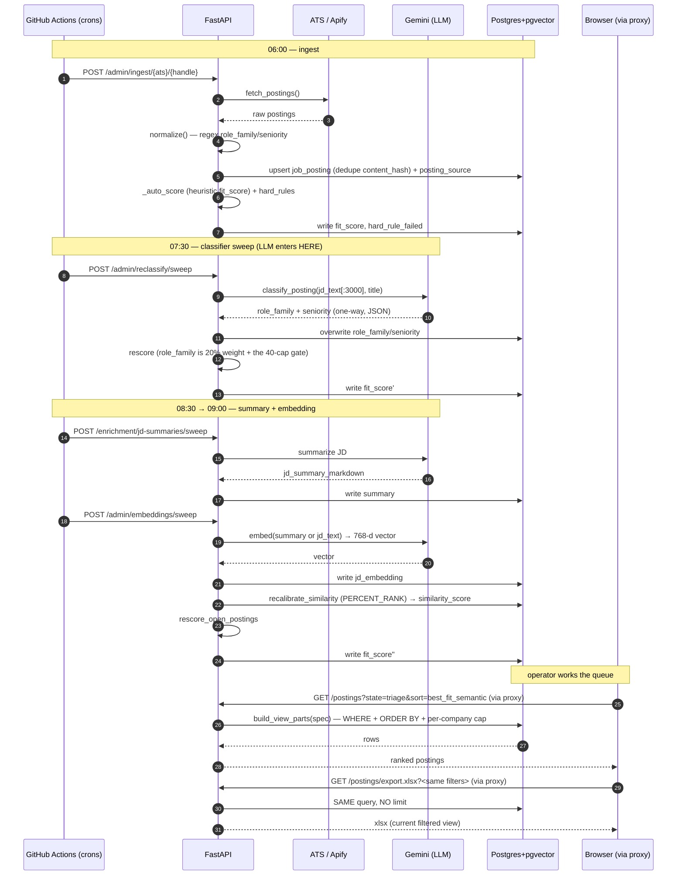
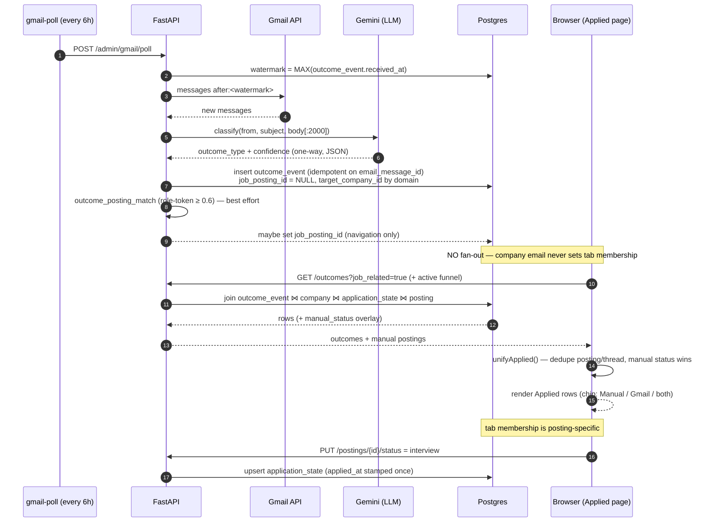

# Job Assist — Architecture Map

> **Read from the actual codebase**, not a concept sketch. Every node and edge below was traced to real source with `file:line` evidence. Edges are marked **confirmed** (seen in code) or **inferred** (reasonable but not directly wired in source). Where something is ambiguous it is flagged rather than guessed.
>
> **Stack:** Next.js (Vercel) front end + same-origin API proxy → FastAPI (Railway) → Postgres + pgvector. Google **Gemini** is the only LLM (classification, summaries, embeddings). **Gmail API** + **Apify** are the external data sources. **GitHub Actions** is the cron/orchestration layer. There is no message queue and no websocket — everything is request/response.
>
> **Visual legend:** 🟦 internal app service · 🟪 LLM (Gemini) · 🟩 database · 🟧 external service/platform · 🟦(cyan) front end · dashed edge = *inferred* · red‑dashed border = *known failure point*.

---

## 0. System Overview — where everything sits and what talks to what

**Components**

- **Front end (🟦 cyan)** — `apps/web`, Next.js App Router. Pages: `/` (Triage), `/applied`, `/passed`, `/rejected`, `/companies`, `/contacts`, `/resumes`, `/pipeline`, `/settings`, `/stats` (`apps/web/src/app/*`). Talks to the back end **only** through the same-origin proxy via an `openapi-fetch` client whose `baseUrl` is `/api/be` (`apps/web/src/lib/api/client.ts:16`). URL search params are the source of truth for filter state (`apps/web/src/lib/triage/filters.ts`).
- **Vercel proxy (🟦 cyan, flagged)** — `apps/web/src/app/api/be/[...path]/route.ts`. Node runtime, `force-dynamic`. Injects the **server-only** `API_AUTH_TOKEN` bearer (never reaches the browser), strips hop-by-hop headers, buffers the body, forwards to Railway, and surfaces upstream failures as a structured `502`. This single hop is the most failure-prone edge in the system (see §5, §8).
- **FastAPI back end (🟦)** — `apps/api/src/job_assist/main.py`. One shared bearer token gates every route **except** `GET /health`. Hosts the ingest engine, scorer, embeddings, Gmail pipeline, and all admin endpoints the crons call.
- **Postgres + pgvector (🟩)** — single Railway database. Core tables: `job_posting` (with `jd_embedding vector(768)`), `posting_source`, `target_company`, `outcome_event`, `application_state`, `posting_action`, `operator_profile`, `ingest_run`, `discovered_handle`.
- **Gemini (🟪)** — the only LLM. Three call sites: posting **classifier** (`role_family`/`seniority`), **JD summaries**/company/division enrichment, and **embeddings** (`gemini-embedding-001`). Gmail outcome classification is a fourth Gemini call.
- **External (🟧)** — Gmail API (read-only), Apify (proxy crawler for IP-blocked boards), the ATS boards themselves, and GitHub Actions (cron + CI/CD).

**Edge directions** — The browser↔proxy↔API↔DB spine is two-way request/response. Ingest→ATS, EMB→Gemini, GM→Gmail, crons→API are one-way calls (the callee returns data inline). `GHA → Railway auto-deploy` and `GHA → Vercel deploy` are **inferred** from `deploy.yml` comments (a Railway webhook is referenced but not defined in-repo).

---

## 1. Ingest subsystem — adapters → dedupe → score → hard-rules → corpus

**The real pipeline** (per posting, `services/ingestion.py`): `fetch_postings()` → optional **title pre-filter** (`should_keep_title`, on for broad-ingest, off for curated) → `normalize()` (which sets `role_family`/`seniority` from **regex heuristics** in `adapters/normalization.py`, *not* the LLM) → **upsert `job_posting`** deduped on **`content_hash`** (`sha256(company+title+locations)`, `:266`) → `_auto_score` → `_eval_hard_rules` → **upsert `posting_source`** deduped on **`(ats, source_job_id)`** (`:432`). Each posting flushes individually.

**Adapters** (`apps/api/src/job_assist/adapters/`, registry in `main.py`) implement a common `Adapter` protocol (`base.py`): `fetch_postings`, `normalize`, `peek_title`. Greenhouse/Lever/Ashby are plain JSON APIs. **Workday and iCIMS use `BROWSER_HEADERS`** (`base.py:18-25`) because their anti-bot layer rejects default `httpx` UAs — and when the block is **IP-based** (datacenter egress), headers aren't enough, which is exactly **why the Apify "Fantastic.jobs" path exists**: it crawls those boards by `domain` from residential infra (`services/fantastic_ingest.py`).

**Dedupe / lifecycle** — A posting is "already seen" by `content_hash`; re-ingest **bumps `last_seen_at`** and clears `closed_at` if it had been marked stale (`:328`). `mark_stale_postings()` sets `closed_at` when a row hasn't been seen for ≥ 7 days (`:469`); the triage list hides `closed_at IS NOT NULL` by default.

**Failure isolation (confirmed)** — `_auto_score` and `_eval_hard_rules` are each wrapped in `try/except` that logs and continues (`:382-387`, `:415-420`); a scoring or rule error **never** fails the ingest run. `fetch` errors are recorded as distinct `ingest_run.status` values (`handle_not_found` vs `failed`).

**Hidden dependency** — The LLM classifier is **not** in this path. `role_family` set here is the cheap regex guess; the Gemini classifier (a separate cron sweep, §2) overwrites it and rescores. So immediately post-ingest, `role_family`/`fit_score` reflect heuristics only.

---

## 2. Scoring & Embeddings — the `v2_semantic` blend, and the LLM's real position

**Heuristic score (`fit_score`)** — `score_posting()` is a **pure function** (no I/O): a weighted mean of six 0–100 sub-scores with weights summing to 100 (`scoring.py:81-89`). Two post-adjustments: the **role-family hard gate** caps any non-PM/PO posting at **40** (`:521`), and a **disguised-senior soft cap** of **55** triggers for PM rows whose seniority is `pm`/`unknown` but whose USD `salary_min ≥ $175k` (`:529`). When `similarity_score` is NULL the `semantic_fit` term is dropped and the remaining weights **renormalize**, so un-embedded rows score on heuristics alone.

> *Note on a doc-drift:* the export's context sheet prose still says "five sub-scores"; the live `_WEIGHTS` dict has **six** (`semantic_fit` was added with `v2_semantic`). The code is authoritative.

**Where the LLM sits (confirmed, and this is the non-obvious part)** — The **classifier is decoupled from ingest**. `classify_posting()` (`services/classifier.py`, model `gemini-2.5-flash-lite`, `temperature=0`, JSON output) is called only by the **reclassify sweep** (`main.py:2000+`, the `enrich-classifier` cron at 07:30). It takes `jd_text[:3000]` + `normalized_title` (+ the operator's profile text *for disambiguation only*), returns `(role_family, seniority_level)`, **overwrites** the regex values, and then **rescores** the row (because role_family+seniority are 40% of the weight). On any failure it falls back to `("other","unknown")` and the row is skipped — never fatal.

**Semantic signal** — The `embed-postings` cron (09:00) runs `sweep_embeddings()`: selects open rows whose vector is missing/stale and under the 3-attempt cap, picks **`jd_summary_markdown` if ≥100 chars else `jd_text[:3000]`**, calls `gemini-embedding-001` (768-d, `RETRIEVAL_DOCUMENT`, L2-normalized), writes `jd_embedding`. **If anything embedded**, it triggers `recalibrate_similarity()` — a single SQL pass computing `similarity_score = ROUND(100 · PERCENT_RANK() OVER (ORDER BY cosine_distance(profile_vector) DESC))` across the open corpus — then `rescore_open_postings()`. The profile vector is the operator's `looking_for_embedding` (`RETRIEVAL_QUERY`), re-embedded on profile save, which **also** triggers recalibrate+rescore (`main.py` profile hook).

**The blend** — The `best_fit_semantic` sort (`postings_query.py:369-387`) is `blended = (1-w)·fit_score + w·COALESCE(similarity_score, fit_score)`, where `w = operator_profile.similarity_weight` (**default 0**). At `w=0` it is byte-identical to `best_fit`; un-embedded rows fall back to `fit_score`, so no row ever gets a fake semantic signal.

**Hidden dependency / failure point** — **Embedding-timing**: `similarity_score` is NULL until the embed sweep *and* recalibration run. The whole semantic feature degrades gracefully to heuristics via the `COALESCE` fallback, but a stalled embed cron silently means "semantic off." The enrichment crons also form an **ordered chain** (company 07:00 → classifier 07:30 → divisions 08:00 → JD-summaries 08:30 → embeddings 09:00); each is idempotent so a stall doesn't block downstream, but downstream runs on staler inputs (e.g. embeddings fall back from summary to raw JD). Gemini **rate limits** and the 3-attempt cap mean a backlog drains over successive days rather than in one run.

---

## 3. Gmail → Outcomes → Pipeline → Applied view (with the no-fanout guard)

**Poll → classify → store** — The `gmail-poll` cron (now **every 6 h**, `0 */6 * * *`) calls `POST /admin/gmail/poll` → `run_poll()`. The Gmail query window is `after:<watermark>` where **watermark = `MAX(outcome_event.received_at)`** (data-derived, no state table; 24 h bootstrap when empty). New messages are classified by **Gemini 2.5 Flash-Lite** (`gmail/classifier.py`, `temperature=0`, JSON) into one of 13 `outcome_type`s, and inserted as `outcome_event` rows. **Idempotency** is the `email_message_id` UNIQUE constraint plus an in-run pre-check.

**The no-fanout guard (the important, non-obvious invariant)** — `outcome_event.job_posting_id` is **NULL by design** in the poll path: Gmail can tie an email to a *company* (by domain) but not to a *specific role*. A company can have many open postings, so folding a company-level "application confirmed" email into tab membership would **fan one email out across every role at that company** (the historical bug: passed-and-never-seen roles appearing in Applied). The guard lives in `services/postings_query.py:resolved_status_expr()`: Applied/Rejected membership is driven **only** by a **posting-specific** signal — the operator's manual `application_state` (authoritative via `COALESCE`) or an explicit `posting_action='applied'` on *that* role. Gmail rejections survive as an **informational hint** field only (`gmail_rejection_exists()`), never as membership. A separate best-effort step (`outcome_posting_match.py`) *may* set `job_posting_id` — but only on a confident **role-token** match (score ≥ 0.6), purely for navigation.

**Pipeline + Applied view** — `application_state` holds the manual lifecycle (`applied→interview→offer→accepted/rejected`; `applied_at` stamped once). The Applied page calls `GET /outcomes?job_related=true` and the active funnel, and `unifyApplied()` (`apps/web/src/lib/applied/unify.ts`) fuses them: it groups Gmail outcomes by thread, re-keys by linked posting (`posting:<id>`) so two threads for one role collapse, and overlays the **manual status as the winner**. `UnifiedAppliedRow` shows a Manual/Gmail/**both** source chip.

**Failure points** — OAuth refresh token (`GMAIL_REFRESH_TOKEN`) auto-refreshes on 401; a **~7-day re-auth cycle is inferred** from Google's standard flow (not enforced in-repo). Gemini rate limits throttle classification (~4 s/request). The watermark design means a missed poll window self-heals on the next run.

---

## 4. Self-maintaining loop — crons → ingest → health-check → alert

**Health = dead-man's-switch** — `GET /admin/ingest/health` (`main.py`) computes a **severity** from four checks over fixed windows (`_HEALTH_RECENT_HOURS = 26`, `_HEALTH_STARVATION_DAYS = 3`):

| Check | Meaning | Weight |
|---|---|---|
| `recent_success` | a successful `ingest_run` within 26 h (daily cron ran) | **hard** → `down` if false |
| `no_hard_failures` | zero `failed` runs in 26 h | **hard** → `down` if false |
| `broad_fresh` | a `discovered_handle` swept within 26 h (broad cron ran) | soft → `degraded` |
| `not_starved` | ≥ 1 net-new posting in 3 days | soft → `degraded` |

`severity = down if any hard fails, else degraded if any soft fails, else ok`.

**Alerting** — `ingest-health.yml` (09:30) curls the endpoint; on unhealthy it opens an **idempotent GitHub Issue**, optionally emails via `dawidd6/action-send-mail` **pinned to a commit SHA**, and `exit 1`s so GitHub's own "workflow failed" mail fires. `cron-health.yml` (08:00) is a parallel guard over `/admin/cron-status`. The front-end **HealthDot** (`components/chrome/HealthDot.tsx`, hook `lib/api/health.ts`) polls every 60 s and renders a 🟢/🟡/🔴 dot. **keepalive** (every 5 min, `GET /health`, no auth) prevents Railway cold-starts.

**Failure points** — A **cron-gap** (a workflow that silently stops firing) is exactly what the 26 h windows + dead-man's-switch catch. The alert path itself depends on GitHub Actions being up and `MAIL_*` secrets being set (email is best-effort; the Issue + run-failure are not).

---

## 5. Proxy / request path — the most failure-prone hop

**Why this hop is special** — The browser never holds the API token; it calls the **same-origin** `/api/be/[...path]`, and the proxy injects the bearer server-side. Two non-obvious bugs lived here (both fixed this session):

1. **`Expect: 100-continue`** — clients (curl/.NET/PowerShell, and some browsers) send this on POST bodies. undici's `fetch` **rejects any request carrying an `Expect` header** (`NotSupportedError: expect header not supported`), so **every write through the proxy failed with an opaque empty 500** while reads and direct-to-Railway curls worked. Fix: add `expect` to `STRIP_REQUEST_HEADERS`.
2. **Streamed body reset** — forwarding `req.body` as a `duplex:'half'` stream intermittently reset the connection on writes. Fix: **buffer** with `req.arrayBuffer()` and let undici set `Content-Length`.

The proxy now wraps the upstream `fetch` in try/catch and returns a structured **`502`** (`{detail, error, upstream_path, method}`) instead of an undiagnosable empty 500 — this is what surfaced the Expect error in the first place.

---

## 6. Lifecycle trace A — a job: ingest → classify → score → embed → triage → export

**LLM position (explicit):** the LLM is called **three times, all asynchronously and all after ingest** — (1) the **classifier** sweep that *replaces* the regex `role_family` and *feeds the scorer*, (2) the **JD-summary** sweep that *feeds the embedder*, (3) the **embedder** whose vector *feeds `similarity_score` → the blend*. Every LLM call is **one-way** (request returns JSON inline; nothing downstream calls back into the LLM). The operator-facing triage list and the export read the **same** `build_view_parts()` query (the export is just the list without `LIMIT`).

---

## 7. Lifecycle trace B — a Gmail confirmation → outcome → pipeline → applied view

**LLM position (explicit):** exactly **one** LLM call — the **Gmail outcome classifier** turns each email into an `outcome_type`. Its output lands in `outcome_event` but is deliberately **firewalled** from Applied/Rejected tab membership (the no-fanout guard); only the operator's manual `application_state`/`posting_action` decides membership. The LLM is again **one-way**.

---

## 8. Hidden dependencies & failure points (the things that bite)

- **Proxy Expect-header (fixed, §5)** — the session's headline bug: writes-only failure with empty 500. *Lesson: the proxy hop is data-shaped, not just a pass-through.*
- **Proxy body streaming (fixed, §5)** — duplex streaming reset writes; now buffered.
- **Railway ~525 KB body cap (latent)** — the edge proxy returns a generic `400 "There was an error parsing the body"` above ~525 KB; mitigation is to batch large seeds (~100 rows). Not in the hot path, but it bit the contacts seed and is documented in `docs/BESTIARY.md` 5.15.
- **Workday/iCIMS IP-blocking** — these boards block datacenter egress, which is the entire reason the **Apify** path exists; Apify carries **real per-call cost**, mitigated by a PM/PO title filter at ingest.
- **Embedding-timing** — `similarity_score` is NULL until the embed sweep + recalibration land; `best_fit_semantic` degrades to heuristics via `COALESCE`. A stalled embed cron = "semantic silently off."
- **Cron-gap** — the dead-man's-switch (26 h windows) is the explicit defense.
- **Gemini rate / attempt caps** — sweeps are limited (50–200 rows) and capped at 3 attempts/row; backlogs drain across days.
- **Merged ≠ working-in-prod** — CI green only proves the build; Railway (API) and Vercel (web) deploy *after* merge, and the proxy/runtime can still fail in prod (exactly how the Expect bug surfaced). Always verify a real write through the proxy post-deploy.
- **Memory on write bursts** — the originally-suspected "OOM" was a mis-diagnosis (the real write failure was the proxy Expect header); the genuine memory design is `rescore_open_postings()`/`sweep_embeddings()` committing in **batches** and expunging ORM objects to keep memory flat.

---

## 9. Legend & accuracy notes

**Visual encoding**

| Encoding | Meaning |
|---|---|
| 🟦 blue node | internal back-end service (FastAPI module) |
| 🟦 cyan node | front end / proxy |
| 🟪 purple hexagon | **LLM** (Gemini — classify / summarize / embed) |
| 🟩 green cylinder | **database** (Postgres + pgvector) |
| 🟧 amber node | **external** service/platform (Gmail, Apify, ATS, GitHub Actions) |
| solid `-->` | confirmed one-way call (callee returns inline) |
| `<-->` | confirmed two-way (request/response with DB read+write) |
| dashed `-.->` | **inferred** edge (not directly wired in source) |
| red-dashed border | known failure point |

**Confirmed vs inferred**

- **Confirmed** (quoted from source): the entire ingest pipeline + dedupe keys; the 6-weight scorer + 40-cap gate + 55 soft-cap; the embedding/recalibrate/rescore chain and the `best_fit_semantic` formula; the LLM being a *separate sweep* (not inline in ingest); the Gmail watermark + idempotency + **no-fanout guard**; the proxy strip-set (incl. `expect`), body buffering, and 502 surfacing; the health severity logic + windows; all cron schedules and targets; the auth boundary (one bearer token, `/health` open).
- **Inferred** (reasonable, not wired in-repo): the **Railway auto-deploy webhook** (referenced in `deploy.yml` comments only); the **~7-day Gmail OAuth re-auth** cadence (Google's standard flow); some **enrichment-ordering dependencies** read from cron *times* rather than explicit code gates; the exact prod hostname `api-production-ca5ad.up.railway.app` (from this session's operations, not committed config).
- **Ambiguous / flagged:** the export context-sheet prose says "five sub-scores" while the live scorer has six — treated as doc-drift, code is authoritative.

> If you change a wire in code, change it here too — this map is only as honest as its last trace.
