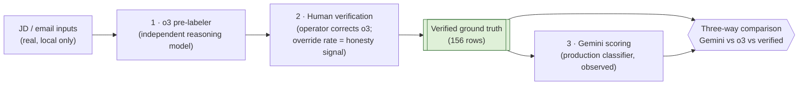

# Job Assist — LLM classifier evaluation (A4)

A reproducible, privacy-first evaluation of the production Gemini classifier
against **human-verified ground truth**, using an independent reasoning model
(OpenAI o3) as a pre-labeler. The point isn't a leaderboard — at this sample
size it can't be — it's the **methodology** and one honest, hypothesis-correcting
finding.

> **Scope of the numbers.** All results below are **illustrative, not
> statistically powered**. Each carries its N. Treat N=90 / N=66 as *stronger
> signal* and N=25 (seniority) as *illustrative only*.

---

## TL;DR — the headline finding

We **hypothesized** that seniority was the classifier's key weakness, because
**77% of production postings carry `seniority = unknown`**. The eval **corrected
that hypothesis**:

- On clean, in-scope PM job descriptions, Gemini **commits to a level** and
  **matches o3 exactly — both 68% (17/25)**.
- The production "unknown problem" is therefore **input coverage**, not
  classifier accuracy: it's driven by broad-ingest **non-PM noise** (sales,
  eng, recruiting, etc.), not by the classifier failing on real PM roles.

That correction — *the weakness we expected wasn't where we thought it was* — is
the result worth reporting. Secondary: **Gemini is competitive with a strong
independent reasoning model across every dimension** (within a few points,
tied on seniority), and **rejection-stage granularity is hard for both models**
(a model-agnostic ambiguity, visible in the confusion matrices).

---

## Methodology

Three stages, each with a distinct role:

1. **Independent pre-labeler (o3).** A different vendor/lineage than the model
   under test (Gemini), with independently-authored prompts and the *exact*
   production enums. o3 proposes labels for each row — a strong, neutral first
   pass, never the model being graded.
2. **Human verification.** The operator confirms or corrects every o3 label.
   The **override rate** (how often the human disagreed with o3) is the
   credibility signal — published, not hidden. Anti-anchoring: for the two
   hardest dimensions (the under-leveling subset and rejection-stage outcomes)
   the operator labeled **cold**, with no model label shown.
3. **Production-model scoring.** The **unchanged** Gemini classifier
   (`classify_posting` for JDs, the Gmail `EmailClassifier` for emails) is run
   over the same rows and scored against the verified labels — alongside o3, for
   a three-way picture.

**Identical-input lock.** Every row stores a `input_sha256` of the exact bytes
it was labeled from (JDs: `description_markdown`; emails: `subject` +
`raw_snippet`). Both o3 and Gemini are scored on those same bytes — the scorer
recomputes the hash per row and **skips + reports** any mismatch. So the
comparison measures *model* difference, never *input* difference.

---

## Results

### role_family (N = 90, stronger signal)

| Model | Accuracy vs verified |
|---|---|
| o3 (independent) | **93.3%** (84/90) |
| Gemini (production) | **82.2%** (74/90) |

o3 leads by ~11 points; Gemini is solid on the function-of-the-role call.

### seniority — PM-ladder rows only (N = 25, illustrative)

Non-PM rows are excluded (seniority is a PM ladder; marking a security
engineer "senior PM" is a category error, not a level). Denominator is the
`n/a_non_pm`-excluded eligible set — identical for both models.

| Model | Accuracy vs verified | Under-leveled |
|---|---|---|
| o3 | **68%** (17/25) | 3 |
| Gemini (production) | **68%** (17/25) | 6 |

**Tied on accuracy.** Gemini under-levels twice as often (6 vs 3) but lands the
same overall — on *clean PM JDs it does commit to a level*. This is the
hypothesis-correcting row: the production `unknown` epidemic is an input-mix
artifact, not classifier failure on real PM roles. (N=25 — illustrative.)

### outcome_type (email lifecycle, N = 66, stronger signal)

| Model | Accuracy vs verified |
|---|---|
| o3 | **66.7%** (44/66) |
| Gemini (production) | **65.2%** (43/66) |

Near-identical, and both middling — because **rejection-stage granularity
(pre-screen vs post-screen vs post-interview) is genuinely ambiguous from a
~200-char snippet**. The errors cluster there for *both* models (see the
committed `gemini_accuracy_summary` confusion matrix locally) — a
**model-agnostic** difficulty, not a Gemini-specific flaw.

### Human override rates (o3 vs verified) — the honesty signal

| Dimension | Override rate | N |
|---|---|---|
| role_family | 6.7% | 90 |
| seniority | 32% | 25 (illustrative) |
| outcome_type | 33% | 66 (rejection-stage driven) |

The operator disagreed with o3 6.7% of the time on role_family — so o3 is a
trustworthy reference there — but a third of the time on seniority and outcome,
confirming those dimensions are hard for humans *and* models alike.

---

## What this demonstrates

- **Multi-provider eval design** — production model (Gemini) judged against an
  independent provider's pre-labels (o3), structurally firewalled.
- **Human-verified ground truth** with the **override rate published** as a
  credibility signal rather than buried.
- **Identical-input rigor** (per-row `input_sha256`), so results isolate the
  model.
- **Privacy-first engineering on a public repo** — every data-bearing step runs
  locally; no real JD/email text ever reaches CI, an artifact, or git.
- **Honest hypothesis correction** — the eval changed our mind about where the
  weakness was, which is the whole reason to run one.

## Honest limitations

- **Small N**, especially seniority (**N=25 — illustrative, not powered**);
  role_family (N=90) and outcome_type (N=66) are stronger but still small.
- **Single annotator** (the operator). No inter-annotator agreement; the
  "ground truth" is one informed human's judgment.
- **Snippet, not full body, for emails** — both models saw the stored `subject`
  + `~200-char raw_snippet`, not the full email. Applied **equally** to both
  sides (the identical-input lock), so the *comparison* is fair, but absolute
  outcome accuracy would likely rise with full bodies.
- **Four outcome types had zero examples** in the sample — `offer`,
  `video_interview_invite`, `panel_interview_invite`, `withdrawn` — so they are
  **unevaluated**, not validated.
- **Placeholder profile-context.** Production passes the operator's
  `looking_for_text` as a minor *disambiguation nudge* to the JD classifier;
  the scored run used a placeholder string, not the real profile text. Expected
  effect is **minor** (it only nudges genuinely borderline titles and never
  overrides the taxonomy), but it means the scored Gemini call is a close — not
  byte-perfect — replica of the production call. Not re-run, by decision.
- **Recovered o3 baseline for the anti-anchor rows.** The original pre-label
  file for the 47 cold-labeled rows was lost; their o3 labels were recovered via
  a fresh independent o3 relabel (valid because those rows were labeled cold,
  with no anchor either way).

## Reproducing (local only)

The full data-bearing pipeline runs on the operator's machine; only code,
methodology, and these aggregate numbers live in the repo. See
[`../../apps/api/src/job_assist/eval/README.md`](../../apps/api/src/job_assist/eval/README.md)
for the `count → generate → verify-build → verify(human) → verify-finalize →
gemini-score` commands. **LangSmith was deliberately skipped** — uploading the
rows would persist real JD/email text in a third-party cloud, a stronger
exposure than the transient classifier API calls; keeping the eval fully local
is the stronger privacy posture. Confusion matrices live in the local
(gitignored) `gemini_accuracy_summary.*.json`; only aggregate rates are
committed here.
